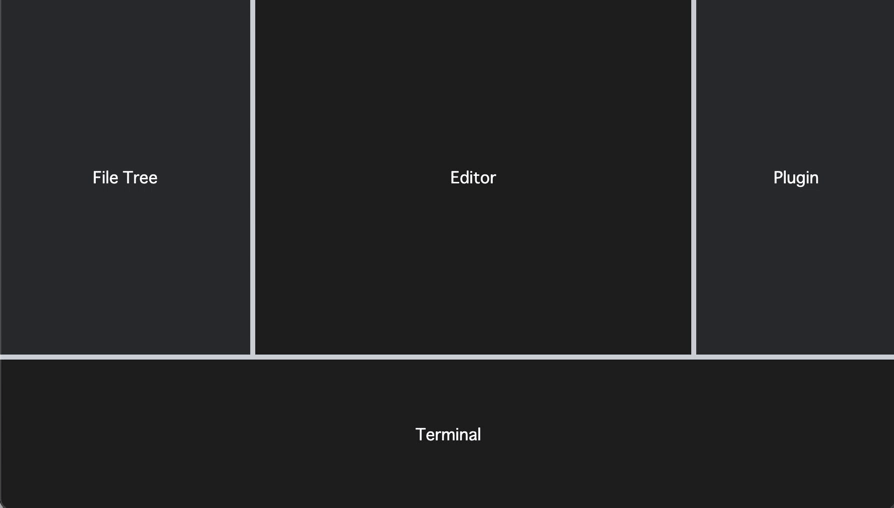

# react-resizable-layout

[](http://badge.fury.io/js/react-resizable-layout)
[](LICENSE)
[](https://bundlephobia.com/package/react-resizable-layout)
[](https://bundlephobia.com/package/react-resizable-layout)
[](https://bundlephobia.com/package/react-resizable-layout)

A lightweight, accessible headless React component and hook for drag-and-drop resizable layouts.



[](https://codesandbox.io/s/react-resizable-layout-jy3vhk?fontsize=14&hidenavigation=1&theme=dark)

[Storybook Demo](https://react-resizable-layout.vercel.app/)

## Features

- 📦 Lightweight
- 🕳 Headless
- 🫶🏽 Accessible 
- 🤏 Drag and Drop Support
- ⌨️ Keyboard Support
- 🫙 Zero Dependencies
  

## Installation

Install from npm:

```
# Using npm
npm install react-resizable-layout

# Using Yarn
yarn add react-resizable-layout
```
  

## Usage
### `Resizable` component

```tsx
import Resizable from 'react-resizable-layout';

<Resizable axis={'x'}>
  {({ position, separatorProps }) => (
    <div className="wrapper">
      <div className="left-block" style={{ width: position }} />
      <YourSeparatorComponent {...separatorProps} />
      <div className="right-block" />
    </div>
  )}
</Resizable>
```

### `useResizable` hook

```tsx
import { useResizable } from 'react-resizable-layout';

const Component = () => {
  const { position, separatorProps } = useResizable({
    axis: 'x',
  })

  return (
    <div className="wrapper">
      <div className="left-block" style={{ width: position }} />
      <YourSeparatorComponent {...separatorProps} />
      <div className="right-block" />
    </div>
  )
}
```
  

## Aria Props
The following attributes are added to `separatorProps` in accordance with W3C.  
https://www.w3.org/TR/wai-aria-1.2/#separator

| Attribute        | Value                          |
|------------------|--------------------------------|
| role             | `'separator'`                  |
| aria-valuenow    | `position`                     |
| aria-valuemin    | `props.min`                    |
| aria-valuemax    | `props.max`                    |
| aria-orientation | `'vertical'` or `'horizontal'` |
| aria-disabled    | `props.disabled`               |
  

## Configuration

### Common Props

| Name          | Type                    | Default  | Required | Description                                                               |
|---------------|-------------------------|----------|----------|---------------------------------------------------------------------------|
| axis          | 'x' or 'y'              | -        | ◯        | Resize direction                                                          |
| containerRef  | ReactRef<HTMLElement>   | -        | -        | Reference to container for calculating position                           |
| disabled      | boolean                 | false    | -        | Disable resize                                                            |
| initial       | number                  | 0        | -        | Initial size                                                              |
| min           | number                  | 0        | -        | Minimum size                                                              |
| max           | number                  | Infinity | -        | Maximum size                                                              |
| reverse       | boolean                 | false    | -        | If true, returns position of the opposite side                            |
| step          | number                  | 10       | -        | Pixel steps when operating with keyboard                                  |
| shiftStep     | number                  | 50       | -        | Pixel steps when operating with keyboard while holding down the shift key |
| onResizeStart | function                | -        | -        | Callback on resize start                                                  |
| onResizeEnd   | function                | -        | -        | Callback on resize end                                                    |

### `Resizable` component children args

`useResizable` hook returns same.

| Name           | Type     | Description                                                    |
|----------------|----------|----------------------------------------------------------------|
| position       | number   | Separator's position (Width for 'x' axis, height for 'y' axis) |
| endPosition    | number   | Separator's position at end of drag                            |
| isDragging     | boolean  | True if dragging                                               |
| separatorProps | object   | Separator's props like onPointerDown                           |
| setPosition    | function | Set separator's position                                       |
  

## About keyboard support
The following keyboard operations are supported.

| Key                               | Operation                                   |
|-----------------------------------|---------------------------------------------|
| Arrow (`↑`,`→`,`↓`,`←`)           | Move the separator by 10px (default)        |
| `Shift` + Arrow (`↑`,`→`,`↓`,`←`) | Move the separator by 50px (default)        |
| `Enter`                           | Reset the separator to the initial position |
  

## About mouse support
Double-click on the separator to return it to its initial position.
  

## Contribution
Feel free to open an issue or make a pull request.
  

## License
Distributed under the MIT License. See [LICENSE](./LICENSE) for more information.
